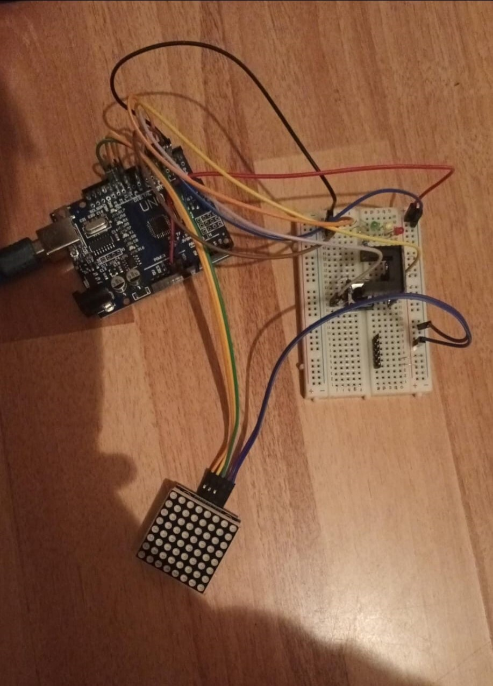

# Arduino application

In this project I created a little game using an Arduino Uno microcontroller, an infrared sensor, three LEDs, a matrix of LEDs, and a breadboard. The game has two modes: the first mode consisting of displaying (on the LED matrix) any word or phrase introduced by the user, and the second mode consisting of controlling the lighting speed of the three LEDs using the sensor.

